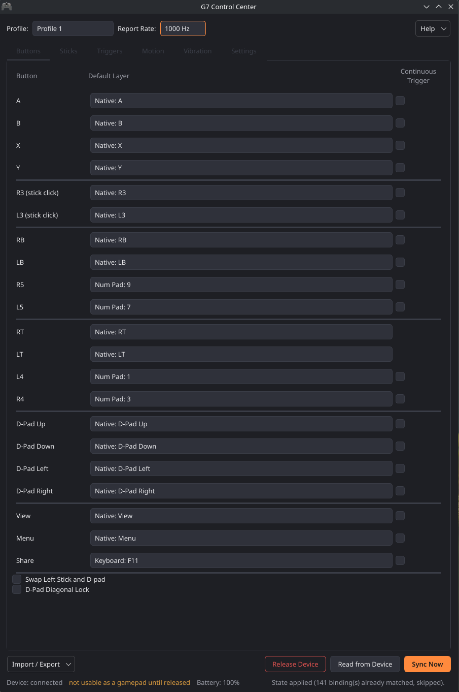

# g7ctl

Configure your GameSir G7 Pro from Linux — button remapping, stick and trigger
tuning, vibration, polling rate, dock settings. No Windows, no Nexus, no VM.



Three pieces, one repo:

- **`g7ctlc`** — the GUI above, plus a system tray icon.
- **`g7ctl`** — a scriptable CLI for the same settings.
- **`pyg7`** — the protocol library both sit on, usable on its own from a
  script or a service. PyUSB only, no Qt.

Every settings category Nexus exposes as a page of its own is mapped, read
*and* write: button remapping (21 buttons across all four profiles, plus the
controller's Shift layer — one layer shared by every profile, not one each;
the whole
keycode picker including native gamepad/paddle functions), sticks, triggers,
vibration, report rate, D-pad options, and the dock's LED brightness and auto
on-off. Every per-profile category targets one of the controller's 4 onboard
slots explicitly, so no on-device button combo is ever needed to pick which
profile a change lands in.

## Install

### Arch Linux

The easiest route, and the only one that sets up USB permissions for you:

```bash
git clone https://github.com/questionablesyntax/g7ctl
cd g7ctl/packaging && makepkg -si
```

That builds three packages — `python-pyg7` (the library), `g7ctl` (the CLI) and
`g7ctlc` (the GUI). Install any subset; the two applications pull the library
in as a dependency.

`python-pyg7` ships the udev rule to `/usr/lib/udev/rules.d/`, so raw USB access
works as your normal user. Replug the controller once afterwards and you're
done — you can skip [Running without root](#running-without-root) entirely.
`g7ctlc` also installs a desktop entry and icon, so the GUI shows up in your
application launcher.

Not on the AUR yet; build it from a checkout as above.

To build the current tip of `main` instead of the last release — protocol fixes
tend to land well before a version is cut — use the VCS PKGBUILD:

```bash
cd g7ctl/packaging/git && makepkg -si
```

That produces `python-pyg7-git`, `g7ctl-git` and `g7ctlc-git`, which conflict
with and provide their stable counterparts: installing `g7ctlc-git` replaces
`g7ctlc`. It clones the repository itself and versions each build as
`<latest tag>.rN.g<hash>` so pacman orders successive builds correctly.

### Anything else

The library needs only [PyUSB](https://github.com/pyusb/pyusb); the desktop app
is an optional extra, so you can install the library alone for scripting.

```bash
pip install -e .          # protocol library + the `g7ctl` CLI
pip install -e ".[gui]"   # also installs PyQt6 and `g7ctlc`
```

Running straight from a checkout works without installing anything — use
`python3 g7ctl_tool.py` and `./g7ctlc_launcher.py` in place of the two commands.

Going this route, raw USB access needs either root or a one-time udev rule —
see [Running without root](#running-without-root), which is the recommended
setup and required for the GUI's tray icon to work.

Packaging for other distros should be straightforward — standard PEP 517 build,
no vendored dependencies, and a test suite that runs without hardware attached.
Contributions doing so are welcome.

## Before you start

**While the app is connected, the controller is not usable for playing — wired
and over the 2.4GHz dongle alike.** This is the app's doing, not a requirement
of reading or writing configuration itself (both identities the controller can
present answer the config protocol equally — see
[PROTOCOL.md](PROTOCOL.md) "Device identities" for the full, corrected
account). What actually causes it: opening a session claims the gamepad
interface directly, which detaches the kernel's `xpad` driver, so there is no
XInput pad while it's held — and, when connecting, the tool moves the
controller off its keyboard/mouse-remapping identity if the active profile
currently needs one (unclaimed, it still enumerates as a working gamepad
either way — see [On-device features](#on-device-features-no-software-needed)
for how that identity gets decided).

That's a property of the controller, not of the cable, and mostly it takes care
of itself: **the GUI hands the controller back whenever its window loses focus**
— tab away to your game and the pad is a pad again, focus the window and it
reconnects. Hiding to the tray counts as losing focus. "Release Device" does the
same thing on demand and stays released until you click "Reconnect". The CLI
holds the device only for the duration of a command. See
[PROTOCOL.md](PROTOCOL.md) "Device identities" for the details.

Expect the wireless controller to be a little slower to respond than the wired
one, handover included — the extra RF hop is why every session (wired
included, as of a 2026-08-29 redesign) runs generously relaxed timeouts,
rather than trying to detect which one it's dealing with and picking
tighter values for wired. That turned out not to be reliably possible in
the first place: a wired baseline identity and its dongle counterpart
share an identical USB descriptor shape, confirmed straight from GameSir's
own compiled firmware.

## Usage

```bash
# Remap a button. The tool handshakes the controller off its keyboard/mouse
# identity itself if needed -- wired or wireless, no separate step needed.
g7ctl remap share f11
g7ctl remap a f12 --shift          # target the Shift Layer instead
g7ctl remap b native_b --profile 2 # target a specific onboard profile

# Read a profile's current settings back from the device
g7ctl read-state --profile 1
g7ctl read-state --profile 1 --save snapshot.json

# Push a whole saved configuration (only writes what actually differs)
g7ctl write-state snapshot.json

# List known button/keycode names (no device needed)
g7ctl list

# Send a raw command for protocol exploration -- no validation at all,
# unlike every other command above; sent to the device exactly as given
g7ctl raw 3c 0305007b013e

# Run several commands in one continuous session -- one handshake instead
# of one per command, useful for a rapid sequence of remaps/settings or a
# read -> apply -> read-to-verify script.
g7ctl batch myscript.txt        # one command per line, '#' comments
cat myscript.txt | g7ctl batch  # or pipe from stdin
g7ctl batch                     # no file -> interactive prompt
g7ctl batch myscript.txt --dry-run           # validate syntax only, no device touched
g7ctl batch myscript.txt --continue-on-error # skip a bad line instead of stopping
```

The keycode table covers every entry in Nexus's own picker — Keyboard, Numpad,
Mouse, and all native gamepad/paddle functions. The byte space itself isn't
exhaustively enumerated, though: at least one region outside those blocks exists
(`0xE6`/`0xE7`, see [PROTOCOL.md](PROTOCOL.md)), so an unrecognised value is
surfaced as raw hex rather than dropped.

## The GUI

```bash
./g7ctlc_launcher.py
```

`python3 -m g7ctlc` and the installed `g7ctlc` command work identically — all
three go through `g7ctlc.app:main()`. Left-clicking the tray icon shows/hides
the window.

- **Tabs** for Buttons, Sticks, Triggers, Vibration and Report Rate, plus a
  Settings tab for the two genuinely global, non-profile-scoped dock settings
  (LED Brightness, Auto On/Off).
- **No managed local profile list.** The device's own 4 profile slots are the
  source of truth, picked directly via the "Profile" selector in the top bar.
- **Automatic reads** on every connect and every profile switch, so the GUI
  never sits there showing stale state after a binding was changed elsewhere.
  Skipped if you have unsynced local edits pending, rather than silently
  discarding them.
- **"Sync Now"** pushes the current in-memory state to the selected profile. It
  reads a fresh baseline first and skips any setting that already matches, so an
  unchanged sync is effectively a no-op instead of rewriting ~30 settings.
- **"Read from Device"** does the same read on demand — useful for catching
  drift from the on-device remap shortcuts below.
- **"Export…" / "Import…"** save or load the entire current state as a JSON
  snapshot at a path you choose.
- **Automatic release on unfocus** — the controller goes back to being a gamepad
  whenever the window isn't focused, and reconnects when it is. A sync or read
  in flight defers the release until it finishes, so tabbing away mid-write
  can't abort it.

Both "Sync Now" and "Read from Device" (when it would discard unsynced edits)
ask for confirmation first — the former pushes to persistent device config, the
latter overwrites every tab.

On startup the app renames its own process to "g7ctlc" via `prctl`, rather than
showing up as "python3". Without it, KDE's taskbar and Window Rules would
identify every window as generic "python3".

To have it show up in KDE's application launcher from a checkout, install the
desktop entry:

```bash
mkdir -p ~/.local/share/applications
sed "s|/path/to/g7ctl|$PWD|g" packaging/g7ctlc.desktop \
  > ~/.local/share/applications/g7ctlc.desktop
```

## Running without root

**Installed the Arch packages? Skip this section** — `python-pyg7` already
shipped the rule. Just replug the controller once. This section is for pip
installs and checkout runs.

Raw USB access normally needs root, but a persistent GUI/tray app shouldn't run
as one — KDE's system tray is a per-session D-Bus registration a root-owned
process can't join, so the tray icon silently never appears.

One-time setup:

```bash
sudo cp udev/61-g7ctl.rules /etc/udev/rules.d/
sudo udevadm control --reload-rules
sudo udevadm trigger
```

Then unplug/replug the controller once so the new rule applies to its device
node — no group, no `usermod`, no log out/in needed. The rule uses
systemd-logind's `uaccess` mechanism, the same one stock rules already use for
USB mice, cameras and scanners, which grants access to whoever's logged in at
the physical seat.

## Filing a bug report

**One command covers the CLI side:**

```
g7ctl diag
```

Finds the controller, captures its USB identity, and pastes-in the
firmware version, a filtered `dmesg` tail (catches re-enumeration churn
around when something went wrong), and — if you've run the GUI at all —
its recent log too. No config writes. Paste the whole output into the
issue.

**For the GUI**, run it with `-v`/`--verbose` first to capture full
diagnostic detail rather than just normal-use progress:

```
g7ctlc -v
```

Whether or not you remembered `-v` beforehand, the GUI always keeps a
log at `~/.config/g7ctl/g7ctlc.log` (rotated automatically, so it won't
grow without bound) — `g7ctl diag` already includes its recent content,
so you usually don't need to attach it separately. If the app closes
unexpectedly, the dialog it shows points back at this same file.

See "Hardware support" below specifically for reporting a variant this
project hasn't seen a USB product ID for yet — same `g7ctl diag`
command, that section covers what it's actually being used to confirm.

## On-device features (no software needed)

The controller does a lot on its own, via button combos. Worth knowing about
regardless of this tool — and two of them can change settings **out from under**
a configuration you synced, which is the main reason "Read from Device" exists.

- **Switch profile:** `M`+`Y` = 1, `M`+`B` = 2, `M`+`A` = 3, `M`+`X` = 4.
  **Can make the controller disconnect and reconnect** — happens when the
  profile you're switching to needs a different keyboard/mouse-interface
  setup than the one you left, not on every switch unconditionally. Not
  just keyboard/mouse button binds either — 1000Hz report rate on its own
  (with no binds at all) has the same effect, and so does setting Motion's
  Output to Mouse. That is the firmware, not this tool — it happens with
  nothing running. Two things follow when it does. Steam (and anything else
  that tracks gamepads) sees a different device and will show it under a
  different name, losing a custom name you assigned. And your keyboard/mouse
  remaps stop working for that window, because the HID keyboard and mouse
  interfaces that emit them are absent while the new profile doesn't need
  them — note the gamepad itself keeps working throughout, so this presents
  as "my remaps broke", not "my controller disconnected".
  See [PROTOCOL.md](PROTOCOL.md) "A profile switch can re-enumerate the
  controller".
- **Remap a back paddle on the fly** (`L4`/`R4`/`L5`/`R5`): hold `M` + the
  paddle until the Xbox indicator flashes slowly, press the button you want
  mirrored onto it, indicator goes solid. Press the paddle again while still
  in setting mode to clear it. This is a firmware-local "mirror this button"
  feature, separate from this tool's USB protocol, and limited to the four
  paddles — **it can silently overwrite a paddle binding this tool wrote.**
- **Toggle Hair Trigger Mode:** hold `M` + `LT`/`RT` for 2 seconds. Also
  independent of this tool, and likewise able to change trigger state
  underneath a synced profile.
- **Recalibrate sticks and triggers:** set the trigger gear switch to analog
  mode, hold `View`+`Xbox`+`Menu` until the indicator flashes, press `A`
  with sticks and triggers untouched, then run both triggers to full travel
  and both sticks to max angle three times each, and press `A` again (solid
  = done). Useful if raw axis values ever look off.
- **LED legend:** breathing = reconnecting to a paired device; flowing =
  Bluetooth pairing mode; solid = connected; off = powered down. **Standby
  is 10 minutes of inactivity** in 2.4GHz or Bluetooth mode.
- The Bluetooth / Wired / 2.4GHz selector is a real 3-position hardware
  switch. The nearby `R4/L4` latch is unrelated — a physical lock for the
  back paddles.

## Hardware support

**The GameSir G7 Pro and its confirmed color/special editions — White
Trimode, Shadow Ember, Zenless Zone.** Confirmed on real hardware, each
its own USB product ID (see `pyg7/variants.py`) — this is not one
signature that happens to cover three colorways, it's three separately
reverse-engineered identities. These are the only hardware this has
actually run on.

Two more G7 Pro editions are believed compatible but unconfirmed for lack
of product-ID data: **Dragon's Dogma 2** and **WUCHANG**. If you own one,
the process is the same as it's always been — find the product ID and
report it, either result is useful.

**Reporting one is one command** — the same `g7ctl diag` covered in "Filing
a bug report" above, used here specifically to capture the USB product ID
this project keys variant identification on. Check out the repo, install
it (see Installation above), and run:

```
g7ctl diag
```

and paste the output into an issue or the Reddit thread. This is the only
way to actually capture the PID this project keys variant identification on
(see PROTOCOL.md "Device identities"), if the controller isn't already
presenting it: a USB device can only present one identity at a time, so
`diag` sends the real, ordinary handshake — the exact same one
`g7ctl enter-vendor` sends, through the same `pyg7` protocol code the rest
of this tool uses, not a second copy of that logic — then reports what it
finds. No config writes, no per-setting protocol traffic, just that one
switch. Run `g7ctl diag --help` for details.

**Everything else is explicitly out of scope, not merely untested: G7 Pro
8K, G7 SE, T7 Pro Floral, T7 Pro Sugar Whirl, Tarantula Pro for Xbox, T7
Kaleid, Kaleid Flux.** Two separate reasons keep these off this project's
support line, and they don't apply the same way to every model on it:

- **The G7 Pro 8K loses by default — it doesn't run through GameSir
  Nexus at all**, the app this protocol was reverse-engineered against.
  Even where the wire format looks compatible on paper, that's
  inference, not anything actually captured — the gap isn't "untested,"
  it's "outside what was ever observed."
- **The rest are covered by GameSir's own Nexus listing** — same vendor
  ID, same `"gamesirapp"` handshake — but adding support without the
  hardware in hand means walking a volunteer through changes over text
  chat with no way to verify device state directly. That failure mode
  isn't "doesn't work" — it's a bricked controller on someone else's
  desk, and that's not a trade worth making on their behalf.

The scope here was always G7 Pro support, and that's done soundly.
Widening it to the rest of the Nexus-controlled family turned out to be
real scope creep, not a natural extension, so the line is drawn on
purpose rather than left open indefinitely.

**Forks are welcome.** `pyg7/` is Apache-2.0 specifically so the protocol
groundwork is buildable on, and support is available for anyone taking
one of the unsupported models further on their own fork.

## Protocol reference

See [PROTOCOL.md](PROTOCOL.md) for the wire format. It's self-contained,
organized for lookup rather than as a narrative, and marks throughout which
values are hardware-confirmed versus predicted from a confirmed pattern.

## Repository layout

| Path | What it is |
|---|---|
| `pyg7/` | Protocol library (Apache-2.0). PyUSB only, no Qt — usable on its own. |
| `g7ctl/` | The CLI. |
| `g7ctlc/` | The GUI + tray app. |
| `g7ctl_tool.py` | Convenience shim: runs the CLI straight from a checkout, no install. Equivalent to the `g7ctl` command. |
| `g7ctlc_launcher.py` | Same idea for the GUI. |
| `packaging/`, `udev/` | Arch PKGBUILDs (`packaging/` for a released tarball, `packaging/git/` for the tip of `main`) and desktop entry; the udev rule for non-root USB access. |

The two root-level scripts exist purely so a fresh `git clone` is runnable with
nothing installed. If you install the package, use the `g7ctl` and `g7ctlc`
commands instead — they do the same thing.

## Development

```bash
python3 -m unittest discover -s tests -t .
```

245 tests, no controller required — payload builders and blob decoders run
against a fake session (`tests/fakes.py`), and `tests/fixtures/live_read.json`
holds real `read_state()` output captured from a physical controller. The GUI's
view round-trip tests (headless, offscreen platform) are skipped automatically
if PyQt6 isn't installed.

Please keep them passing; they exist because a wrong byte here doesn't raise an
error, it writes something unintended to a device's persistent config.

## Contributors

v0.2.1 exists because people on Reddit reported bugs on hardware this project
had never seen and helped test the fixes against their own controllers —
[@tyrohellion](https://github.com/tyrohellion), GenderGambler, Ninja_Daemon117,
OuToU, and Rokofur. Thank you.

## License

Copyright 2026 J Whittington (questionablesyntax).

Two licenses, matching the package split:

- **`pyg7/` (the protocol library) — Apache-2.0.** Permissive on purpose. The
  protocol work is the useful part, and anyone should be able to build on it: a
  distro daemon, a Steam Input helper, another tool.
- **`g7ctlc/`, `g7ctl/`, and the project as a whole — GPL-3.0-or-later.**

### Not affiliated with GameSir

This is an independent, unofficial project, developed without the involvement or
endorsement of Guangzhou Chicken Run Network Technology Co., Ltd. "GameSir" and
"G7 Pro" are used only to identify the hardware this tool works with. No GameSir
code, firmware, or documentation is redistributed here — the protocol was
derived by observing USB traffic to and from a controller we own, and every line
in this repository was written from those observations.
